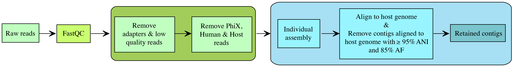

# VTPhageFinder

VTPhageFinder is designed to identify phages from single-strain viral tagging data. 

## Workflow



## Set up environment

### Clone the repository 

```bash
git clone https://github.com/xwu35/VTPhageFinder.git
```

### Install Snakemake

VTPhageFinder is built for Snakemake version 7. Version 8 and above introduce breaking changes and deprecations and have not been tested. It may not function correctly with newer versions. Please install Snakemake version 7 using the script below.

```bash
cd VTPhageFinder

# option 1 using conda
conda env create -n snakemake -f snakemake_env.yml

# option 2 using mamba if it's installed
mamba env create -n snakemake -f snakemake_env.yml
```

### Move snakemake profile

The profile is required to run the workflow on HPC.

```bash
# move the profile to the right directory
mv slurm ~/.config/snakemake
```

## Sample information table

The sample information table should look like this:

| sample   | R1                                                                                         | R2                                                                                         |
|----------|--------------------------------------------------------------------------------------------|--------------------------------------------------------------------------------------------|
| Fp22_10A | Baldridge_10A_Fp22_CD_SIC_index_0496_SIC_index_0550_TCACTACAG_CGCTACTA_S74_R1_001.fastq.gz | Baldridge_10A_Fp22_CD_SIC_index_0496_SIC_index_0550_TCACTACAG_CGCTACTA_S74_R2_001.fastq.gz | 
| Fp22_3C  | Baldridge_3C_Fp22_HHC_SIC_index_0498_SIC_index_0543_TTGAGAGTG_CAAACCTG_S20_R1_001.fastq.gz | Baldridge_3C_Fp22_HHC_SIC_index_0498_SIC_index_0543_TTGAGAGTG_CAAACCTG_S20_R2_001.fastq.gz | 
| Fp22_7B  | Baldridge_7B_Fp22_CD_SIC_index_0497_SIC_index_0547_GAGATGAAA_GTGTAGAG_S51_R1_001.fastq.gz  | Baldridge_7B_Fp22_CD_SIC_index_0497_SIC_index_0547_GAGATGAAA_GTGTAGAG_S51_R2_001.fastq.gz  | 
| Fp22_8G  | Baldridge_8G_Fp22_CD_SIC_index_0539_SIC_index_0548_TGTGAGGCT_AGGTCGCA_S64_R1_001.fastq.gz  | Baldridge_8G_Fp22_CD_SIC_index_0539_SIC_index_0548_TGTGAGGCT_AGGTCGCA_S64_R2_001.fastq.gz  | 

## Usage

VTPhageFinder supports two mapping software options (bowtie2 and minimap2), with minimap2 used by default. Detailed usage information can be viewed using the -h or --help flags `python VTPhageFinder.py -h`.

### dry run 

A dry-run can be performed to check which rules will be executed and which files will be produced. 

```bash
conda activate snakemake

python VTPhageFinder.py \
    --reads_dir test_data/sequences \
    --sample_info test_data/sample_info.txt \
    --output_dir FpVT_output \
    --reference_genome resources/Fp22_genome/fp22_assembly.fasta \
    --prophage_region resources/Fp22_genome/fp22_prophage_region.bed \
    --dryrun
```

### Run test data

Do not run this on the login node. Submit it as an sbatch job on the HPC using `sbatch run_vtphagefinder.sh`. Make sure to update the --mail-user field before submitting the job.

```bash
conda activate snakemake

python VTPhageFinder.py \
    --reads_dir test_data/sequences \
    --sample_info test_data/sample_info.txt \
    --output_dir FpVT_output \
    --reference_genome resources/Fp22_genome/fp22_assembly.fasta \
    --prophage_region resources/Fp22_genome/fp22_prophage_region.bed 
```

### Specific steps

Specific steps can be run using the `--step` flag. 

- **fastqc**: QC on raw reads
- **preprocess**: run fastqc and trim the reads
- **assemble**: all steps (fastqc, preprocess, assemble trimmed reads into contigs and remove contigs aligned to the host genome with >= 95% ANI over 85% AF)

VTPhageFinder runs all steps by default.

## Output description

- **Quality control results**: output_dir/reads_processing/fastqc
- **Trimmed reads used for assembly**: output_dir/reads_processing/filtered_reads
- **Read counts**: output_dir/reads_processing/reads_statistics/{number_of_reads_removed_at_each_step.txt,reads_composition_barplot.svg}
- **Retained contig sequences**: output_dir/check_contig_contamination/no_host_contig_sequences


