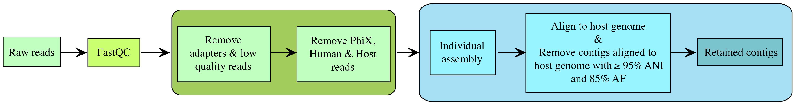

# VTPhageFinder

VTPhageFinder is designed to identify phages from single-strain viral tagging data. 

## Workflow



The quality of sequencing reads is assessed using [FastQC](https://www.bioinformatics.babraham.ac.uk/projects/fastqc/) v0.12.1 and [MultiQC](https://github.com/MultiQC/MultiQC) v1.14. Adapter contamination and low-quality reads are removed using [Trimmomatic](http://www.usadellab.org/cms/?page=trimmomatic) v0.39. Reads mapped to the Phix and human genomes are removed using the selected mapping tool ([Bowtie2](https://github.com/BenLangmead/bowtie2) v2.4.2 or [Minimap2](https://github.com/lh3/minimap2) v2.28) and [SAMtools](https://github.com/samtools/samtools) v1.21. Following the removal of Phix and human contamination, reads mapping to prophage regions of the host genome with 100% identity are excluded, while reads mapping to non-prophage regions with >= 98% identity are discarded using the filter mode from [CoverM](https://github.com/wwood/CoverM) v0.7.0. The filtered bam files from prophage and non-prophage regions are merged and subsequently converted to FASTQ files using SAMtools v1.21. The resulting sequences are then assembled individually using the selected assembler ([SPAdes](https://github.com/ablab/spades) v4.1.0 or [MEGAHIT](https://github.com/voutcn/megahit) v1.2.9). Contigs with a length >= 1kb are used to conduct a [BLASTN](https://www.ncbi.nlm.nih.gov/books/NBK279690/) (version 2.14.0) search against the host genome. Average nucleotide identity (ANI) and alignment fraction (AF) values are calculated from BLASTN results using the anicalc.py script from [CheckV](https://bitbucket.org/berkeleylab/checkv/src/master/) v1.0.1. Contigs that align to the host genome with ANI >= 95% and AF >= 85% are removed from the final contig set. 

## Set up environment

### Clone the repository 

```bash
git clone https://github.com/xwu35/VTPhageFinder.git
```

### Install Snakemake

VTPhageFinder is built for Snakemake version 7. Version 8 and above introduce breaking changes and deprecations and have not been tested. It may not function correctly with newer versions. Please install Snakemake version 7 using the script below.

```bash
cd VTPhageFinder

# option 1 using conda
conda env create -n snakemake -f snakemake_env.yml

# option 2 using mamba if it's installed
mamba env create -n snakemake -f snakemake_env.yml
```

### Download snakemake profile

The profile is required to run the workflow on HPC. Skip this step if you already have a SLURM profile in `~/.config/snakemake`.

```bash
# download the profile
git clone https://github.com/xwu35/slurm

# move the profile to the right directory
mv slurm ~/.config/snakemake 
```

## Sample information table

The sample information table should look like this:

| sample   | R1                                                                                         | R2                                                                                         |
|----------|--------------------------------------------------------------------------------------------|--------------------------------------------------------------------------------------------|
| Fp22_10A | Baldridge_10A_Fp22_CD_SIC_index_0496_SIC_index_0550_TCACTACAG_CGCTACTA_S74_R1_001.fastq.gz | Baldridge_10A_Fp22_CD_SIC_index_0496_SIC_index_0550_TCACTACAG_CGCTACTA_S74_R2_001.fastq.gz | 
| Fp22_3C  | Baldridge_3C_Fp22_HHC_SIC_index_0498_SIC_index_0543_TTGAGAGTG_CAAACCTG_S20_R1_001.fastq.gz | Baldridge_3C_Fp22_HHC_SIC_index_0498_SIC_index_0543_TTGAGAGTG_CAAACCTG_S20_R2_001.fastq.gz | 
| Fp22_7B  | Baldridge_7B_Fp22_CD_SIC_index_0497_SIC_index_0547_GAGATGAAA_GTGTAGAG_S51_R1_001.fastq.gz  | Baldridge_7B_Fp22_CD_SIC_index_0497_SIC_index_0547_GAGATGAAA_GTGTAGAG_S51_R2_001.fastq.gz  | 
| Fp22_8G  | Baldridge_8G_Fp22_CD_SIC_index_0539_SIC_index_0548_TGTGAGGCT_AGGTCGCA_S64_R1_001.fastq.gz  | Baldridge_8G_Fp22_CD_SIC_index_0539_SIC_index_0548_TGTGAGGCT_AGGTCGCA_S64_R2_001.fastq.gz  | 

## Usage

VTPhageFinder supports two mapping software options (bowtie2 and minimap2) and three assembler options (megahit, metaspades and spades_sc), with minimap2 and spades_sc (single cell mode) used by default. Detailed usage information can be viewed using the -h or --help flags `python VTPhageFinder.py -h`.

### dry run 

A dry-run can be performed to check which rules will be executed and which files will be produced. 

```bash
conda activate snakemake

python VTPhageFinder.py \
    --reads_dir test_data/sequences \
    --sample_info test_data/sample_info.txt \
    --output_dir FpVT_output \
    --reference_genome resources/Fp22_genome/fp22_assembly.fasta \
    --prophage_region resources/Fp22_genome/fp22_prophage_region.bed \
    --dryrun
```

### Run test data

Do not run this on the login node. Submit it as an sbatch job on the HPC using `sbatch run_vtphagefinder.sh`. Make sure to update the --mail-user field before submitting the job.

```bash
conda activate snakemake

python VTPhageFinder.py \
    --reads_dir test_data/sequences \
    --sample_info test_data/sample_info.txt \
    --output_dir FpVT_output \
    --reference_genome resources/Fp22_genome/fp22_assembly.fasta \
    --prophage_region resources/Fp22_genome/fp22_prophage_region.bed 
```

### Specific steps

Specific steps can be run using the `--step` flag. 

- **fastqc**: QC on raw reads
- **preprocess**: run fastqc and trim the reads
- **assemble**: all steps (fastqc, preprocess, assemble trimmed reads into contigs and remove contigs aligned to the host genome with >= 95% ANI over 85% AF)

VTPhageFinder runs all steps by default.

## Output description

- **Quality control results**: output_dir/reads_processing/fastqc
- **Trimmed reads used for assembly**: output_dir/reads_processing/filtered_reads
- **Read counts**: output_dir/reads_processing/reads_statistics/{number_of_reads_removed_at_each_step.txt,reads_composition_barplot.svg}
- **Retained contig sequences**: output_dir/check_contig_contamination/no_host_contig_sequences

## Citation

If this pipeline is used for analysis, please cite the relevant software publications.

- **Snakemake**: Mölder, F., Jablonski, K. P., Letcher, B., Hall, M. B., Tomkins-Tinch, C. H., Sochat, V., Forster, J., Lee, S., Twardziok, S. O., Kanitz, A., Wilm, A., Holtgrewe, M., Rahmann, S., Nahnsen, S., & Köster, J. (2021). Sustainable data analysis with Snakemake [version 1; peer review: 1 approved, 1 approved with reservations]. F1000Research, 10(33). https://doi.org/10.12688/f1000research.29032.1

- **FastQC**: Andrews, S. (2010). FastQC: A Quality Control Tool for High Throughput Sequence Data. Available online at: http://www.bioinformatics.babraham.ac.uk/projects/fastqc

- **MultiQC**: Ewels, P., Magnusson, M., Lundin, S., & Käller, M. (2016). MultiQC: summarize analysis results for multiple tools and samples in a single report. Bioinformatics, 32(19), 3047–3048. https://doi.org/10.1093/bioinformatics/btw354

- **Trimmomatic**: Bolger, A. M., Lohse, M., & Usadel, B. (2014). Trimmomatic: a flexible trimmer for Illumina sequence data. Bioinformatics, 30(15), 2114–2120. https://doi.org/10.1093/bioinformatics/btu170

- **Bowtie2**: Langmead, B., Wilks, C., Antonescu, V., & Charles, R. (2019). Scaling read aligners to hundreds of threads on general-purpose processors. Bioinformatics, 35(3), 421–432. https://doi.org/10.1093/bioinformatics/bty648

- **Minimap2**: Li, H. (2021). New strategies to improve minimap2 alignment accuracy. Bioinformatics, 37(23), 4572–4574. https://doi.org/10.1093/bioinformatics/btab705

- **SAMtools**: Danecek, P., Bonfield, J. K., Liddle, J., Marshall, J., Ohan, V., Pollard, M. O., Whitwham, A., Keane, T., McCarthy, S. A., Davies, R. M., & Li, H. (2021). Twelve years of SAMtools and BCFtools. GigaScience, 10(2), giab008. https://doi.org/10.1093/gigascience/giab008

- **CoverM**: Aroney, S. T. N., Newell, R. J. P., Nissen, J. N., Camargo, A. P., Tyson, G. W., & Woodcroft, B. J. (2025). CoverM: read alignment statistics for metagenomics. Bioinformatics, 41(4), btaf147. https://doi.org/10.1093/bioinformatics/btaf147

- **MEGAHIT**: Li, D., Liu, C. M., Luo, R., Sadakane, K., & Lam, T. W. (2015). MEGAHIT: An ultra-fast single-node solution for large and complex metagenomics assembly via succinct de Bruijn graph. Bioinformatics, 31(10), 1674–1676. https://doi.org/10.1093/bioinformatics/btv033

- **SPAdes**: Prjibelski, A., Antipov, D., Meleshko, D., Lapidus, A., & Korobeynikov, A. (2020). Using SPAdes De Novo Assembler. Current Protocols in Bioinformatics, 70(1). https://doi.org/10.1002/cpbi.102
 
- **MetaSPAdes**: Nurk, S., Meleshko, D., Korobeynikov, A., & Pevzner, P. A. (2017). MetaSPAdes: A new versatile metagenomic assembler. Genome Research, 27(5). https://doi.org/10.1101/gr.213959.116

- **BLAST**: Camacho, C., Coulouris, G., Avagyan, V., Ma, N., Papadopoulos, J., Bealer, K., & Madden, T. L. (2009). BLAST+: Architecture and applications. BMC Bioinformatics, 10. https://doi.org/10.1186/1471-2105-10-421

- **CheckV**: Nayfach, S., Camargo, A. P., Schulz, F., Eloe-Fadrosh, E., Roux, S., & Kyrpides, N. C. (2021). CheckV assesses the quality and completeness of metagenome-assembled viral genomes. Nature Biotechnology, 39(5). https://doi.org/10.1038/s41587-020-00774-7


